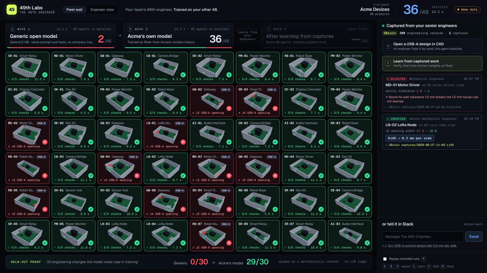

# The 49th Engineer, by 49th Labs

**Your team's 49th engineer. Trained on your other 48.**

When a circuit board changes, The 49th Engineer refits the enclosure around it. It uses an open model fine-tuned on the company's own engineering-change history, and a deterministic checker grades every result before anyone relies on it. When an engineer corrects it in one sentence, it learns the rule into the weights without forgetting the rules it already knew.

Demo customer: **Acme Devices**, a fictional hardware company. We generated its history so the ground truth is known and grading is objective.

## Headline results

Every number below is graded by the same deterministic checker (five geometry checks, no LLM judge) and comes from a result file in this repo.

| Result | Before | After: Acme-tuned (River LoRA) |
|---|---|---|
| **Held-out eval:** 30 engineering changes the model never saw (Qwen3.5-9B) | generic **0/30** | **29/30** after about 17 min of training |
| **Bigger models, same 30 changes** | generic Qwen3.5-397B-A17B **1/30** · Qwen3.5-122B-A10B **1/30** · Qwen3.6-35B-A3B **0/30** | 397B **30/30** (partial run: 23 of 52 planned steps) · 122B **28/30** (1 epoch, 13 steps) · 35B **30/30** |
| **The wall:** 48 real open-source KiCad boards refit in parallel | generic **16/48** | v1 **42/48** → after one correction **48/48** |
| **Learning from one sentence:** "Our USB-A cutouts always get 0.5 mm per side." | Acme v1: USB-A held-out **0/12** | **12/12** (108.6 s end to end). A repeat run of the same 8-step recipe scored **30/30** on the regular held-out set (v1: 29/30) |

Sources: `rev/data/eval_results.json`, `rev/large/{q397b,q122b,q35b}/results.json` (the three large bases are River's FP8 checkpoints), `rev/data/fleet_results_real.json`, `rev/data/learn_last.json` (the promoted run) and `rev/data/pr_replays.json` (the repeat run with the 30/30 regression check; its checkpoint is in `rev/data/checkpoint_pr2.json`). The fairness audit is in [`EVAL_AUDIT.md`](EVAL_AUDIT.md).



*The fleet wall at `/fleet`. This screenshot was taken in the UI's demo-data mode, so its counters are placeholders. The measured counts are the ones in the table above. `web/_shots/live_fleet_1920.png` shows the live page loaded with the 48 real boards.*

## Why

- **The knowledge that matters was never written down.** Nobody writes a spec for per-side clearance, the tolerance on each connector cutout, or "we always leave 3 mm above the tallest part." Those rules only show up in the team's revision history, as the same fix applied hundreds of times. A generic model has never seen that history, so it guesses, and scale doesn't fix that: Qwen3.5-397B-A17B passes 1/30.
- **Hardware design data is sensitive.** Board layouts and enclosure CAD are often under NDA. Teams want a model they own rather than a prompt on someone else's model. (What we offer is ownership, not isolation: see "Ownership, stated precisely" below.)
- **So the useful model is trained on the company's own history, belongs to the company, and is checked before anyone trusts it.**

## Architecture

| Layer | Component | Job | What the company owns |
|---|---|---|---|
| **Teammate / fleet** | **QM** (self-hosted, local Docker) | Where the team talks to the agent (web UI, Slack). It receives "Rev B landed" and runs the refit or the correction | its QM deployment |
| **Weights** | **River** (LoRA SFT + sampling on an open Qwen base) | Skill: how this company engineers, learned from past changes and corrections | its own versioned LoRA checkpoints on an open-weight base |
| **Facts and records** | **GBrain** (local PGLite brain) | What's true about the project now, plus the engineering-change records: 200 historical ECOs, CAD captures and lesson pages | its markdown records |
| **Proof and learning gate** | Deterministic checker (ours, `rev/kernel.py`) | Grades every refit, and every practice example must pass it before it can be learned | code |
| *Next capture source* | *Memorable* | *Procedural memory from agent tool-call traces. **Not integrated in this build.*** | |

The rule we hold to: **facts go in GBrain and skill goes in the weights.** Project dimensions change every revision, so they live in memory. The company's way of doing things holds across projects, so it goes into the weights.

> GBrain remembers what's true. Memorable remembers how it's done. 49th Labs turns it into weights your company owns.

GBrain and Memorable both store knowledge, and neither one fine-tunes a model. 49th Labs is the step that turns verified records into weights. Memorable's traces are the next capture source we would feed into that loop. It is not wired up in this build.

```
QM thread / web UI / bin/49th            senior engineer saves an OpenSCAD file
"Rev B landed, refit the enclosure"      (rev/watcher.py diffs the save)
          │                                        │
          ▼                                        ▼
   49th Engineer server ◄── GBrain ──────► captures/ record (who, file, diff, checks)
          │                 (facts, 200 ECO records, captures, lessons)
          ▼
   River: Acme LoRA on Qwen3.5-9B ──► JSON tool calls ──► parametric enclosure kernel
                                                                  │
                                                                  ▼
                                               deterministic checker ──► pass/fail + change record ──► GBrain
                                                                  │
                                    corrections and captures ─────┴──► verified lesson ──► River continues the LoRA
```

**Ownership, stated precisely.** This build is not air-gapped. QM and GBrain run locally. Training and sampling run on River's hosted API, so prompts containing board geometry are sent to River, and QM's agent uses a hosted LLM. What the company owns is an open-weight base model, its own LoRA checkpoints (versioned `river://` adapters, each one recording its parent) and its GBrain records.

## How it works

**The model's engineering API.** The model never writes geometry. It emits a JSON array of tool calls against a small parametric enclosure kernel:

- `fit_cavity(clearance, headroom)`
- `place_standoff(hole)` / `remove_standoff(hole)`
- `place_opening(connector, tolerance)` / `remove_opening(connector)`

The tools take clearance and tolerance as arguments. **The company's values are never in the prompt.** Clearance and headroom can be partly inferred from the old enclosure. The tolerance for a connector type that isn't on the current board can only come from the weights.

**House rules are learned, not prompted.** Acme's rules are 1.5 mm clearance per side, 3.0 mm headroom, one standoff per mounting hole, and a different opening tolerance for each connector type. They live only in the data generator and the checker, which uses them as hidden ground truth for grading.

**Training v1.** The training set is 200 past engineering changes, and the held-out set is 30 more (disjoint seeds). Each example contains the Rev A board and enclosure, the Rev B board, a change summary and the minimal correct tool calls. The run was a River LoRA (rank 32) on Qwen/Qwen3.5-9B: 4 epochs, 52 steps, about 17 minutes.

**Where the base model fails.** It always returns valid tool calls, but it guesses generic values (clearance 1.0 to 2.0 mm, headroom 5 to 10 mm, opening tolerance 0.5 to 1.0 mm). Per-check passes, base → tuned: clearance 16 → 30, headroom 14 → 30, standoffs 27 → 30, openings 0 → 29, no orphans 30 → 30. The one tuned failure (test-013) left out the `tolerance` argument on one opening.

## How learning from one correction works

A connector type the company has never shipped is the hard case. On the wall, 5 of v1's 6 red boards are USB-A boards that failed the openings check (v1 used 0.6 mm per side on the USB-A cutouts), and Acme's history contains no USB-A. The sixth red board is an SD-card board where v1 also removed the SD-card opening that should have stayed. An engineer fixes the USB-A case with one sentence:

```
bin/49th teach "Our USB-A cutouts always get 0.5 mm per side."
```

1. **Parse.** The sentence becomes a rule: `{"type": "usb_a", "tolerance": 0.5}`.
2. **Practice changes.** The system generates 48 engineering changes on synthetic boards that add or move a USB-A connector, with the corrected tolerance as the gold answer. **All 48 are checked by the deterministic checker**, and only verified examples are learned. If fewer than half pass, the lesson is rejected and nothing is trained. (In this benchmark the checker already holds Acme's USB-A value as grading ground truth, so a sentence that contradicts it would fail this gate.)
3. **Anti-forgetting mix.** Every training batch is 50/50: 8 lesson examples plus 8 past company changes replayed from history, which place openings for the other connector types.
4. **Continue, don't restart.** The run continues the v1 LoRA on River (`create_model(..., checkpoint=<v1>)`) for 8 steps at lr 1e-4. The promoted run took 108.6 s end to end.
5. **Evaluate.** On 12 held-out USB-A changes, the score goes from **0/12 to 12/12**. A repeat run of the same recipe (same seeds and batches, continuing from the same v1; `rev/data/pr_replays.json`) also ran the regression check on the 30 regular held-out changes and scored **30/30** (v1 scored 29/30). The promoted checkpoint itself was not re-run on that set. Its no-forgetting evidence is the wall below, where the 39 boards without USB-A all still pass.
6. **Promote and roll back.** The new checkpoint records its parent. `bin/49th reset` returns to v1.
7. **Re-run the wall.** The same 48 real boards on the new weights score **48/48**.

**The problem we had to solve.** Our first naive attempt overgeneralized. The model learned "0.5 mm" rather than "0.5 mm for USB-A", started putting 0.5 mm on every connector, and failed held-out changes it used to pass. (We didn't save that run's scores, so we don't quote a number.) We fixed it three ways:
- **Replay:** half of every batch is past company history, so the other tolerances stay in the loss.
- **Contrast examples:** about 70% of the lesson changes (`CONTRAST_P = 0.7` in `rev/learn.py`) also add or move a connector of a different type, whose opening keeps that type's own house tolerance. This ties 0.5 mm to USB-A specifically.
- **Continued training:** we continue the v1 adapter instead of starting a fresh one. In an early exploratory run (6 small steps; its log is not in the repo), a fresh LoRA trained on history plus the lesson reached only 4/12 on USB-A.

**The same loop runs from CAD.** When a senior engineer edits the USB-A opening in an OpenSCAD file and saves it, `rev/watcher.py` diffs the save into `place_opening(J3, tolerance=0.5)` and checks its geometry. It then writes a `captures/` record to GBrain with who made the edit, which file, the diff and the checks. `POST /api/capture/learn` pulls the verified captures back out of GBrain, derives the same lesson and runs the same River update. The result is written back as a `lessons/usb_a-opening-tolerance` page that links the evidence captures and the `river://` checkpoint. Captures that disagree by more than 0.05 mm are flagged and not learned. See [`CAPTURE_DEMO.md`](CAPTURE_DEMO.md).

## Quickstart

You need Python 3 with `fastapi`, `uvicorn`, `httpx`, `rich`, `numpy`, `requests` and `river-client`. Put your River credentials in `.env` (`RIVER_API_KEY`, optional `RIVER_MODEL`). `.env` is never committed. GBrain (`gbrain` CLI, local PGLite brain) is optional: GBrain calls never raise, so without it the record pages are simply skipped.

```bash
# 1. the server (from the repo root)
python3 -m uvicorn rev.server:app --port 8000

# 2. the two pages
open http://localhost:8000          # engineer view: one product, Rev A -> Rev B
open http://localhost:8000/fleet    # the wall: 48 real KiCad boards (FLEET_SOURCE=synthetic loads the generated fleet)

# 3. the CLI (see CLI.md)
bin/49th status                     # customer, checkpoint v1/v2, GBrain record counts, QM, server health
bin/49th eval                       # held-out table: generic vs Acme-tuned, including the big models
bin/49th eval --wall                # plus the three wall waves
bin/49th teach "Our USB-A cutouts always get 0.5 mm per side."            # live River update (~110 s), promotes v2
bin/49th teach --replay "Our USB-A cutouts always get 0.5 mm per side."   # replays the last real run (for re-takes)
bin/49th refit B                    # land Rev B and refit with the tuned model: tool calls, 5 checks, 3D link
bin/49th reset                      # back to v1 weights and Rev A
```

`bin/49th` uses `/opt/anaconda3/bin/python3` by default. Set `FORTYNINE_PYTHON` to use another interpreter and `FORTYNINE_SERVER` to point at another server.

**Keyboard shortcuts.** Engineer view: `1` Rev B lands, `2` generic model, `3` Acme-tuned model, `E` eval drawer, `R` reset, `F` fit view. Wall: `1` generic wave, `2` Acme v1 wave, `3` wave after the correction, `P` toggle "Replay recorded runs", `C` open a CAD file, `L` learn from captures, `R` reset.

**QM.** QM runs locally in Docker, and its web UI is at `http://localhost:9081`. The agent's `rev-refit` and `rev-learn` tools call this server through a tunnel. Setup, including the Slack Socket Mode steps, is in [`qm/LOCAL_RUN.md`](qm/LOCAL_RUN.md).

**Tests:** `python3 -m pytest tests/`

## What's real and what's synthetic

- **Real:** every River training and sampling run, every checkpoint and every number in this README. All of them are graded by the checker in `rev/kernel.py`. "Replay" modes only replay earlier real runs, and the UI labels them as replays.
- **Real board geometry:** the wall's 48 boards are real open-source KiCad designs, drawn from 185 boards in 173 licensed GitHub repos (see [`REAL_DATA.md`](REAL_DATA.md)). Their outlines, mounting holes and connectors come from the design files.
- **Synthetic:** Acme Devices and its house rules, the 200 training and 30 held-out ECOs, the 12 held-out USB-A changes, the 48 practice changes generated from a correction, and the Rev B change applied to each real board. In the capture demo, we play the senior engineer.
- **Where the ground truth lives:** the checker holds Acme's house values in order to grade. The model never sees them. The generic model's 0/30 is a control that shows the values can't be guessed. The result that matters is that training recovered them. With a real customer, the geometry checks carry over unchanged, and the house values would be the ones the customer's senior engineers sign off on.

## Limitations

- **Synthetic history.** We have not trained on a real company's ECO history yet. The held-out set comes from the same generator as the training set, so this measures generalization to unseen boards within one company's distribution.
- **One capability.** It refits an open-top rectangular box with standoffs and wall openings. It does not handle lids, fasteners, draft angles, thermal analysis or electrical changes.
- **The checker checks only what we encoded.** It proves a change follows the house rules and the geometry. It does not prove the part is manufacturable.
- **Small numbers.** The eval is n=30, with one training run per base model. River sampling is not bit-deterministic at temperature 0.
- **Not air-gapped.** River is a hosted API and QM's agent uses a hosted LLM (see "Ownership" above).
- **`teach` promotion is not gated.** `bin/49th teach` (`rev/learn.py`) reports its before/after scores and then promotes. It does not refuse to promote on a regression, and it does not run the 30-change regression check unless you call `python3 -m rev.learn --heldout`.
- **Memorable is positioning, not code.** Nothing in this repo calls Memorable.

## Repo map

The Python package is `rev/` (the project's codename was "rev").

| Path | What's in it |
|---|---|
| `rev/kernel.py` | Board and enclosure model, the five tools, the deterministic checker, Acme's house values |
| `rev/tasks.py`, `rev/prompts.py` | ECO generator (train/test/demo) and prompts (no house values) |
| `rev/river_util.py`, `rev/train_river.py`, `rev/eval.py` | River client, renderer, checkpoints; v1 training; held-out eval |
| `rev/large/` | The same eval and training on Qwen3.5-397B-A17B, Qwen3.5-122B-A10B and Qwen3.6-35B-A3B (the 397B run was stopped early by a deadline; the 122B run was planned as 1 epoch to fit one) |
| `rev/agent.py`, `rev/server.py` | Agent loop and FastAPI server with SSE, `/api/qm/refit` for QM |
| `rev/fleet.py`, `rev/fleet_api.py`, `rev/real_boards.py` | The wall (48 parallel refits) and the KiCad parser for real boards |
| `rev/learn.py`, `rev/learn_api.py` | Learning from one correction (verify, replay, continue LoRA, eval, promote) |
| `rev/watcher.py`, `rev/capture_api.py`, `rev/scad.py`, `rev/pipeline_api.py` | CAD capture: OpenSCAD diff → checked capture → GBrain → lesson → River |
| `rev/gbrain_io.py`, `rev/gbrain_history.py`, `rev/gbrain_dataset.py` | GBrain wrapper, the 200 historical ECO records, captures and lessons |
| `rev/data/` | Train/test sets, checkpoints (`river://` refs), every result file quoted above |
| `rev_cli/`, `bin/49th` | The `49th` terminal CLI ([`CLI.md`](CLI.md)) |
| `web/index.html`, `web/fleet.html` | Engineer view (three.js) and the fleet wall |
| `qm/` | QM skill, `rev-refit` / `rev-learn` tools, local Docker run notes |
| `brain/`, `workstation/` | GBrain seed pages; OpenSCAD files for the capture demo |
| `tests/` | pytest suite |
| `SUBMISSION.md`, `VIDEO_SCRIPT.md`, `PITCH.md`, `EVAL_AUDIT.md`, `CAPTURE_DEMO.md`, `REAL_DATA.md`, `SPEC.md`, `PLAN.md` | Submission text, video plan, pitch, eval audit, capture demo, board attribution, build contracts, build plan |

## Credits

- **Real board geometry:** 185 openly licensed KiCad designs from 173 public GitHub repos. Every board is listed with its repo, license and pinned file URL in [`REAL_DATA.md`](REAL_DATA.md). Repos without a license GitHub recognizes were excluded. Share-alike and attribution licenses are honored by keeping each board's `source` with its derived data.
- **Models:** the open-weight Qwen3.5 and Qwen3.6 families.
- **Built on:** River (training and serving), GBrain (memory and records) and QM (the self-hosted agent harness).
